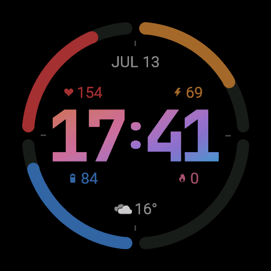
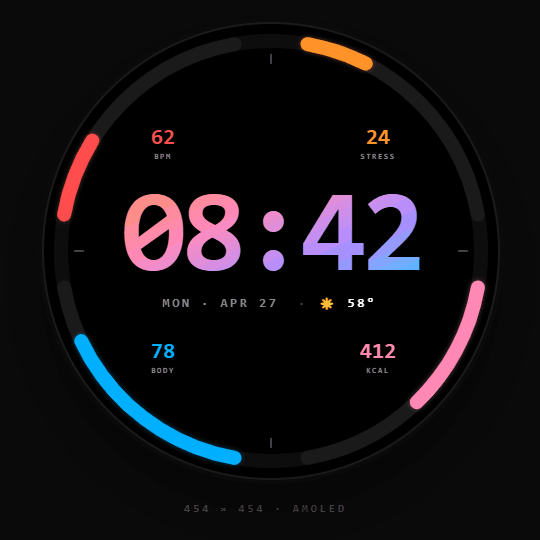

# Forerunner Watch Face — Connect IQ (Monkey C)

A 454×454 round AMOLED watch face for the Garmin Forerunner 965:

- **4 arc gauges** around the bezel, each driven by a user-assignable complication
  - top-left (red) — heart rate by default
  - top-right (orange) — stress by default
  - bottom-left (blue) — body battery by default
  - bottom-right (rose) — calories by default
- **Date** row above the time (e.g. `APR 28`)
- **24-hour time** displayed as pre-tinted bitmap digits (orange → rose → purple → blue)
- **Weather** below the time — a condition icon plus temperature (e.g. `⛅ 18°`)
- **Always-on (low power) mode** with AMOLED burn-in protection

## Screenshots


|  |  |
|:-:|:-:|
| Current implementation | Envisioned design |


## Project layout

```
monkeyc/
  manifest.xml                    Connect IQ app manifest (target: fr965, minApi 4.2.0)
  monkey.jungle                   Build config
  source/
    ForerunnerWatchFaceApp.mc     AppBase entry point
    ForerunnerWatchFaceView.mc    All rendering logic (~727 lines)
  resources/
    strings/strings.xml           App name ("Forerunner")
    drawables/drawables.xml       56 bitmap registrations
    images/
      launcher_icon.png           40×40 launcher icon
      hr.png, stress.png,
        body.png, calories.png    Arc metric icons (flat, pre-tinted per slot)
      weather_*.png               10 weather condition icons
      h1_0..h1_9.png              Hours tens digit (orange-tinted)
      h2_0..h2_9.png              Hours units digit (rose-tinted)
      colon_colon.png             Colon separator (purple-tinted)
      m1_0..m1_9.png              Minutes tens digit (purple-tinted)
      m2_0..m2_9.png              Minutes units digit (blue-tinted)
  tools/
    gen_arc_icons.py              Regenerates the pre-tinted arc metric icons
```

## Complications

The four arcs are backed by the **Connect IQ Complications** framework. The face
allocates four complication slots (0–3), each mapped to a fixed bezel position and
accent color:

| Slot | Position | Color | Default complication | Icon |
|---|---|---|---|---|
| 0 | top-right | orange | Stress | stress |
| 1 | bottom-right | rose | Calories | kcal |
| 2 | bottom-left | blue | Body Battery | body |
| 3 | top-left | red | Heart Rate | hr |

The color and icon are **fixed per position** — they do not change when the user
reassigns a slot. Users pick which data field fills each slot via the Garmin Connect
watch-face settings; `onComplicationChanged()` requests a redraw when an assignment
changes. `getCompMax()` supplies a sensible full-scale value per known complication
type so each arc fills proportionally.

Temperature and the weather-condition icon come from their own dedicated
complications (`CURRENT_TEMPERATURE` and `CURRENT_WEATHER`).

## Architecture

### ForerunnerWatchFaceView.mc

All drawing is done in a single `WatchFace` subclass. Key sections:

| Section | What it does |
|---|---|
| `initialize()` | Loads the digit resource tables and allocates the six complication IDs (guarded by `Toybox has :Complications`) |
| `onLayout()` | Computes `scale`, `arcRadius`, `arcStroke`, `labelRadius` from actual screen size |
| `readComplications()` | Reads the four arc complications each frame |
| `readTemp()` | Reads the temperature complication; respects the system C/F preference |
| `readWeatherIcon()` | Maps all Garmin `CONDITION_*` constants to one of 10 weather PNG icons |
| `drawArcs()` | Four progress arcs over a dim track, with filled-circle endcaps for a rounded look |
| `drawThickDesignArc()` | Splits wide strokes into two overlapping passes to hide a firmware seam artifact |
| `drawCardinalTicks()` | Short divider ticks at the four arc gaps |
| `drawTime()` | Renders five bitmap images (h1, h2, colon, m1, m2); each position has its own tint |
| `drawDateWeatherRow()` | Date string (above time) and temperature + weather icon (below time) |
| `drawArcLabels()` | Metric icon + formatted integer value, above/below center per slot |
| `drawLowPower()` | Minimal always-on rendering (see below) |

### Always-on mode & AMOLED burn-in protection

`onEnterSleep()` / `onExitSleep()` toggle a low-power flag; in low power `onUpdate()`
delegates to `drawLowPower()`, which draws only a dim `HH:MM` string and shifts it
around a 5×5 pixel grid over 25 minutes so no pixel stays continuously lit.

In full-power mode several measures reduce image retention:

- All arc accent colors are dimmed to ~65% of the original design values (kept in
  sync with `BRIGHTNESS` in `tools/gen_arc_icons.py`).
- The cardinal ticks drift radially outward by 0–4 px on a 5-minute cycle.
- The arc value labels drift vertically by ±2 px on a 5-minute cycle, mirrored
  about the screen center.

### Why pre-tinted bitmap digits?

Monkey C has no gradient fill for text. Each digit image is pre-colored at design
time, giving the visual impression of an `orange → rose → purple → blue` gradient
across the clock face with no runtime cost.

## Required permissions

Declared in `manifest.xml`:

| Permission | Used for |
|---|---|
| `ComplicationSubscriber` | Reading the arc, temperature, and weather complications |

## Building

1. Install the [Garmin Connect IQ SDK](https://developer.garmin.com/connect-iq/sdk/) and the VS Code **Monkey C** extension.
2. Open the `monkeyc/` folder as the project root in VS Code.
3. Run **Monkey C: Build for Device** and select `fr965`.
4. Sideload the resulting `.prg` via the Connect IQ desktop app, or run it in the simulator.

The project targets `fr965` only (min API 4.2.0). To add more 454×454 AMOLED devices
(Fenix 7 Pro, Epix 2 Pro, Venu 3) add `<iq:product id="fenix7pro"/>` etc. to
`manifest.xml`.

## Notes on fidelity vs. the HTML design

| HTML feature | Monkey C approach |
|---|---|
| Smooth anti-aliased arcs | `dc.setAntiAlias(true)` + filled circles for rounded endcaps |
| Wide arc strokes | Split into two overlapping passes to hide a firmware anti-alias seam |
| CSS `linear-gradient` time text | Pre-tinted bitmap digit images per position |
| Glow under arcs | Omitted — requires offscreen buffers and hurts AMOLED battery |
| `oklch()` colors | Approximated to nearest sRGB hex, then dimmed to ~65% for burn-in |
| Sun / weather glyphs | `CONDITION_*` constants mapped to 10 weather PNG icons |
| Stress / body / calorie values | Coerced via `.toNumber()` / `"%d"` to avoid `35.000000` strings |

## Before publishing

- `manifest.xml` `id="..."` — replace the placeholder UUID with a fresh one (`monkeyc -g`).
- `resources/images/launcher_icon.png` — must be a real 40×40 PNG.
- Expand `<iq:products>` if targeting devices beyond `fr965`.
- App store name, description, and screenshots.

## AI assistance

The visual design and all Monkey C source code were generated with the assistance of [Claude](https://claude.ai) (Anthropic) and [Gemini](https://gemini.google.com) (Google). Human authorship covers the design brief, layout decisions, and iterative review.
