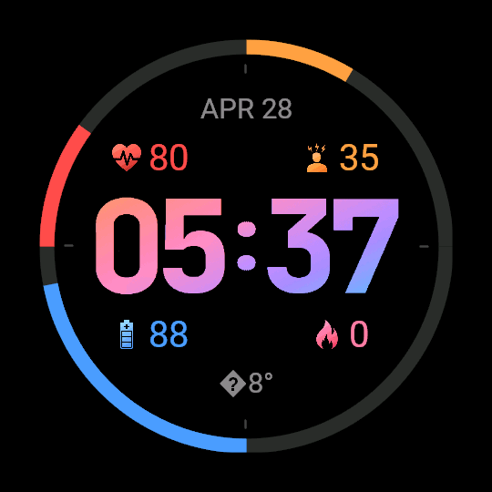

# Forerunner Watch Face — Connect IQ (Monkey C)

A 454×454 round AMOLED watch face for the Garmin Forerunner 965:

- **4 colored arc gauges** around the bezel
  - red — heart rate
  - orange — stress
  - blue — body battery
  - rose — calories
- **Date** row above the time (e.g. `APR 28`)
- **24-hour time** displayed as pre-tinted bitmap digits (orange → rose → purple → blue)
- **Weather** below the time (e.g. `⛅ 18°`)

## Screenshots


|  |  |
|:-:|:-:|
| Current implementation | Envisioned design |


## Project layout

```
monkeyc/
  manifest.xml                    Connect IQ app manifest (target: fr965, minApi 3.2.0)
  monkey.jungle                   Build config
  source/
    ForerunnerWatchFaceApp.mc     AppBase entry point
    ForerunnerWatchFaceView.mc    All rendering logic (625 lines)
  resources/
    strings/strings.xml           App name ("Forerunner")
    drawables/drawables.xml       53 bitmap registrations
    images/
      launcher_icon.png           40×40 launcher icon
      hr.png, stress.png,
        body.png, calories.png    Arc metric icons
      h1_0..h1_9.png              Hours tens digit (orange-tinted)
      h2_0..h2_9.png              Hours units digit (rose-tinted)
      colon_colon.png             Colon separator (purple-tinted)
      m1_0..m1_9.png              Minutes tens digit (purple-tinted)
      m2_0..m2_9.png              Minutes units digit (blue-tinted)
```

## Architecture

### ForerunnerWatchFaceView.mc

All drawing is done in a single `WatchFace` subclass. Key sections:

| Section | What it does |
|---|---|
| `onLayout()` | Computes `scale`, `arcRadius`, `arcStroke`, `labelRadius` from actual screen size |
| `readData()` | Aggregates HR, stress, body battery, calories from `ActivityMonitor` + `SensorHistory` |
| `readTemp()` | Reads current temperature via `Toybox.Weather`; respects system C/F preference |
| `readWeatherIcon()` | Maps all 54 Garmin `CONDITION_*` constants to Unicode weather symbols |
| `drawArcs()` | Four colored progress arcs with filled-circle endcaps for a rounded look |
| `drawTime()` | Renders five bitmap images (h1, h2, colon, m1, m2); each position has its own tint |
| `drawDateWeatherRow()` | Date string (above time) and temperature + weather icon (below time) |
| `drawArcLabels()` | Metric icon + formatted integer value, fixed rows above/below center |

Sensor state (`_lastHr`, `_lastStress`, `_lastBody`) is cached between frames to survive transient dropouts.

### Why pre-tinted bitmap digits?

Monkey C has no gradient fill for text. Each digit image is pre-colored at design time, giving the visual impression of an `orange → rose → purple → blue` gradient across the clock face with no runtime cost.

## Required permissions

Declared in `manifest.xml`:

| Permission | Used for |
|---|---|
| `Background` | Periodic updates while watch face is active |
| `Sensor` | Live heart rate |
| `SensorHistory` | Stress + body battery history |
| `UserProfile` | User's weight/age (activity calculations) |

## Building

1. Install the [Garmin Connect IQ SDK](https://developer.garmin.com/connect-iq/sdk/) and the VS Code **Monkey C** extension.
2. Open the `monkeyc/` folder as the project root in VS Code.
3. Run **Monkey C: Build for Device** and select `fr965`.
4. Sideload the resulting `.prg` via the Connect IQ desktop app, or run it in the simulator.

The project currently targets `fr965` only. To add more 454×454 AMOLED devices (Fenix 7 Pro, Epix 2 Pro, Venu 3) add `<iq:product id="fenix7pro"/>` etc. to `manifest.xml`.

## Notes on fidelity vs. the HTML design

| HTML feature | Monkey C approach |
|---|---|
| Smooth anti-aliased arcs | `dc.setAntiAlias(true)` + filled circles for rounded endcaps |
| CSS `linear-gradient` time text | Pre-tinted bitmap digit images per position |
| Glow under arcs | Omitted — requires offscreen buffers and hurts AMOLED battery |
| `oklch()` colors | Approximated to nearest sRGB hex |
| Sun / weather glyphs | 54 `CONDITION_*` constants mapped to Unicode symbols |
| Stress / body / calorie values | Coerced via `.toNumber()` / `"%d"` to avoid `35.000000` strings |

## Before publishing

- `manifest.xml` `id="..."` — replace the placeholder UUID with a fresh one (`monkeyc -g`).
- `resources/images/launcher_icon.png` — must be a real 40×40 PNG.
- Expand `<iq:products>` if targeting devices beyond `fr965`.
- App store name, description, and screenshots.

## AI assistance

The visual design and all Monkey C source code were generated with the assistance of [Claude](https://claude.ai) (Anthropic) and [Gemini](https://gemini.google.com) (Google). Human authorship covers the design brief, layout decisions, and iterative review.
